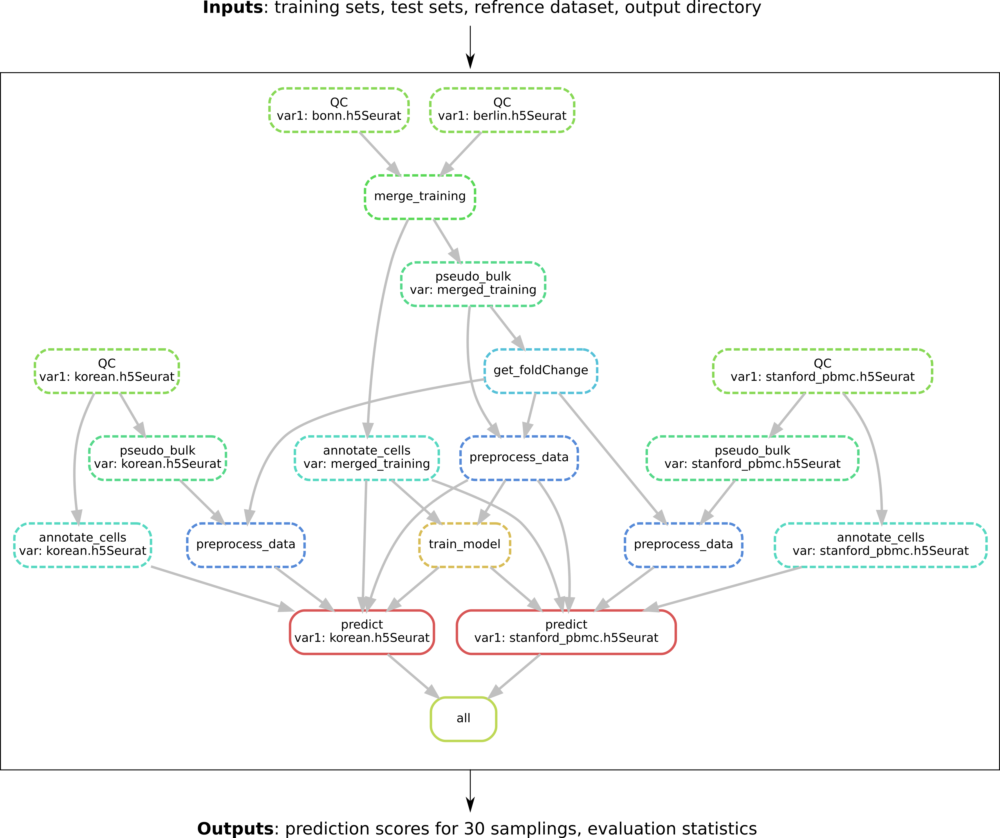

COVID-19 severity prediction tool
================================

Snakemake pipeline for predicting severity in COVID-19.


Overview
--------

The workflow shown below allows predicting COVID-19 severity from scRNA-seq data. The workflow parameters should be set in the config file provided as a parameter for the snakemake command. The inputs are: 

- The training sets: list of datasets that will be used for the training
- The testing sets: list of datasets to be tested by the trained model
- The output directory
- The number of Top genes differentially expressed between conditions to be selected

<p align="center">
  
</p>

Quick Setup
-----------

```bash
# clone the repo
git clone https://github.com/AminaLEM/Prediction_scOmics

# set code base path
SNK_REPO="`pwd`/Prediction_scOmics"

```

Config file
-----------
Please provide input datasets in the Seurat format h5Seurat. 

* To convert h5ad file to h5Seurat, please use:

```bash
library(seuratDisk)
Convert("filename.h5ad", dest = "h5seurat", overwrite = TRUE)
```
* To save  an rds file as h5Seurat, please use (Check out [Conversions](https://mojaveazure.github.io/seurat-disk/articles/convert-anndata.html) vignette for further details):

```bash
library(seuratDisk)
SaveH5Seurat($varibale_name, filename = "filename.h5Seurat")
```

Please put all your input datasets in one directory. 

The input datasets should contain the following metadata columns: 
* "sampleID": sample IDs
* "condition": Mild or Severe
* "batch": the batch name of your data
* "who_score": if availbale else =condition (it serves as a factor for the training/validation split)

Here is the config file for the testing example. Data can be found in [zenodo](https://doi.org/10.5281/zenodo.7193236).


```
# INPUT & OUTPUT PATHS
path_out: "../../output"          # path to the output directory, if it doesn't exist it will be created 
path_inp: "../data"           # path to the directory containing input datasets in h5Seurat format


# INPUTS PARAMS
training_data:               # Training datasets
    set1:  'bonn.h5Seurat'        
    set2:  'berlin.h5Seurat'        
    
test_data:               # Testing datasets
    set3:  'korean.h5Seurat'        
    set3:  'stanford_pbmc.h5Seurat'        

```
Note that you can set as many training and testing datasets as you want. Datasets under `training_data` will be merged, 80% of samples (not cells) will be used for the training, and 20 % for the validation split randomly 30 times. 

Output files
-----------------------

Once the pipeline has run successfully, you should expect the following files in the output directory:
*   **`merge_training/`:**
    *   `QC.rds` - merged data
    *   `pseudo_bulk.h5Seurat` - expression average of all genes
    *   `fold_change.csv` - output of the DE analysis between conditions (findMarkers). 
    *   `selected_ge.csv` - expression average of the top genes
    *   `annotation.csv` - matrix representing the number of each cell per sample & type
    *   `MLP_CC.pkl` - the learned model based on the Cell Composition (CC)
    *   `MLP_GE.pkl` - the learned model based on the Gene Expression (GE)
    *   `MLP_CC_GE.pkl` - the learned joint model based on the Cell Composition (CC) and the Gene Expression (GE)
    *   `train_set.pkl` - list of the training sets from the 30 samplings
    *   `val_set.pkl` - list of the training sets from the 30 samplings
    *   `val_set.pkl` - list of the training sets from the 30 samplings
    *   `fig_metrics.pdf` - figures representing the different evaluation metrics (AUROC, AUPRC, Accuracy, ...) between the three models "CC, GE, and CC&GE"
    *   `pred_GE.csv` - prediction output scores per column of the validation set using the GE model (you will get as many columns as the number of samplings)
    *   `pred_CC.csv` - prediction output scores per column of the validation set using the CC model (you will get as many columns as the number of samplings)
    *   `pred_CC_GE.csv` - prediction output scores per column of the validation set using the joint model (you will get as many columns as the number of samplings)
    *   `pred_GE.txt` - evaluation metrics represented by the mean and the confidence interval of 95% of the validation set using the GE model
    *   `pred_CC.txt` - evaluation metrics represented by the mean and the confidence interval of 95% of the validation set using the CC model
    *   `pred_CC_GE.txt` - evaluation metrics represented by the mean and the confidence interval of 95% of the validation set using the joint model
*   **`{test_data_filename}/`:** - contains testing set. This include the following files: `selected_ge.csv`,`annotation.csv`, `QC.rds`
*   **`{Pred}/`:** - contains the prediction result for the merged testing set. This include the following files: `fig_shap.pdf`, `MLP_GE.csv`, `MLP_CC.csv`, `MLP_CC_GE.csv`, `MLP_GE.txt`, `MLP_CC.txt`, `MLP_CC_GE.txt` and comparison to baseline models (Logistic regression, SVM and Random forest)

Reproducibility: Conda   
----------------------

One option to enhance reproducibility is to install software used via Conda.

You can find Miniconda installation instructions for Linux [here](https://docs.conda.io/projects/conda/en/latest/user-guide/install/linux.html).
Make sure you install the [Miniconda Python3 distribution](https://docs.conda.io/en/latest/miniconda.html#linux-installers).
```
wget https://repo.anaconda.com/miniconda/Miniconda3-latest-Linux-x86_64.sh
bash Miniconda3-latest-Linux-x86_64.sh
```
For performance and compatibility reasons, you should install `Mamba` via conda to install Snakemake. See [Snakemake documentation](https://snakemake.readthedocs.io/en/stable/getting_started/installation.html) for more details.
```
conda install -c conda-forge mamba
```
Once you have installed Conda and Mamba, you can install the software dependencies via the following commands:

```bash
# install environment using Conda
mamba env create --file ${SNK_REPO}/environment.yml

# activate the new Conda environment
conda activate severityPred_env
```


Reproducibility: Docker
-----------------------

An alternative option is to use a Docker image. One can easily generate a Docker image of all of the software used in this repository using the Dockerfile. 

```bash
# build the Docker image using the Dockerfile
cd ${SNK_REPO}
docker build -t immun2sev .
```

1- A pre-compiled Docker image without snakemake pipeline is housed on the DockerHub 'aminale/test:firstpush'. You can download and use the Docker image and run using the cloned repository as follow:

```bash
# download the Docker image 
docker pull aminale/test:firstpush

# run the Snakemake pipeline through the container
docker run -t -v ${SNK_REPO}:/SNK_REPO -v $(pwd):/CUR_DIR -e USERID=$UID aminale/test:firstpush \
        "snakemake --cores all all --snakefile /SNK_REPO/src/snakefile --directory /CUR_DIR \
        --configfile /SNK_REPO/src/config.yml --printshellcmds"

```
2- A pre-compiled all-in-one Docker image, including snakemake pipeline, is housed on the DockerHub 'aminale/immun2sev:firstpush'. You can download and use the Docker image as follow:

```bash
# download the Docker image 
docker pull aminale/immun2sev:latest

# run the Snakemake pipeline through the container
docker run -it --rm --mount "type=bind,src=Host_directory,dst=Path_in_container" immun2sev \
      "snakemake --cores all all --snakefile src/snakefile  --configfile /Path_to_config/config.yml"
```

Reproducibility: Singularity
----------------------------

A final option is to load the above Docker image using Singularity, designed for high-performance computing systems. To do so: 

1- Using singularity as an option for snakemake

* install snakemake via conda (See [Snakemake documentation](https://snakemake.readthedocs.io/en/stable/getting_started/installation.html) for more details)

```bash
conda activate base
conda install snakemake
```

* add the --use-singularity flag when calling snakemake 
* bind the path to your input data (e.g --singularity-args "-B /prj") to the command.
Note that the docker image was already added as a DOCKER variable to the config file (config.yml).

As an example, see below.
```bash
snakemake --cores all all --snakefile ${SNK_REPO}/scr/snakefile \
          --configfile ${SNK_REPO}/src/config.yml --use-singularity \
          --singularity-prefix ${SNK_REPO}/.snakemake/singularity \
          --singularity-args "-B /prj" --printshellcmds

```
2- Using all-in-one image


```bash 
singularity run -B /Host_directory aminale_immun2sev_latest.sif \
                  "snakemake --cores all all --snakefile src/snakefile  \
                  --configfile /path_to_config/config.yml --directory /writable_directory"
```
Singularity image aminale_immun2sev_latest.sif can be found in [zenodo](https://doi.org/10.5281/zenodo.6811191) or you can convert the  pre-compiled all-in-one Docker image to singularity as described [here](https://docs.sylabs.io/guides/2.6/user-guide/singularity_and_docker.html). 

Notes & Tips
------------

- Please make sure to mount/bind all host repositories you use (for inputs and outputs) into your container and set a writable directory for the --directory option in snakemake. 
- Sometime snakemake stucks because of running the pipeline multiple time simultaniuosly e.g celltype-specific prediction, in this case you need to run the pipeline without doing anything and it will pick up from where it left off.
